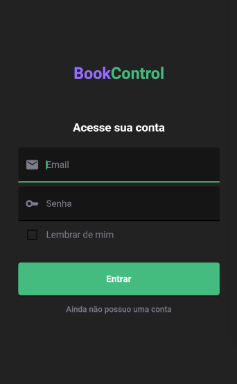
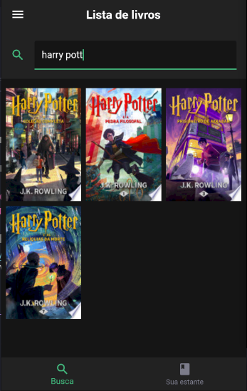
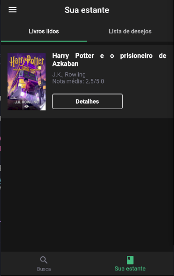

<h1 align="center" width="50%">BookControl</h1>
<h1 align="center" width="50%">
  
  
  
  
</h1>

<h1 align="center" >
 
 
 
 
</h1>


## ⚡️ O projeto
Esse projeto foi criado para o trabalho final da disciplina de C214 no INATEL, consiste em um aplicativo desenvolvido em Flutter no qual é possível fazer o controle de suas leituras, listando livros que você já leu ou que deseja ler no futuro.
  
## 🎯 Funcionalidades
 - Login com email e senha com Firebase
 - Conexão com banco de dados Realtime do Firebase
 - Conexão com a API de livros do Google 
  
## 🖥️ Used Technologies
 - [Dart](https://dart.dev/)
 - [Flutter](https://flutter.dev/)
 - [Firebase](https://firebase.google.com/)
 - [Book API Google](https://developers.google.com/books)
## ⚙️ Dependências
 - [Flutter](https://flutter.dev/)
 
## 🚀️ Utilizando o projeto

1. Clone este repositório: 

```bash
git clone https://github.com/avnerjose/INATEL-projeto-C214.git && cd INATEL-projeto-C214
```
2. Instale as dependências

```bash
flutter pub get
```
3. Inicie um emulador Android com o AndroidStudio
```bash
emulator -avd <nome_do_emulador_disponível>
```
4. Execute o app
```bash
flutter run
``` 

## 🧪 Testes 


1. Gerar os Mocks

```bash
flutter pub run build_runner build
```
2. Executar os testes

```bash
flutter test
```
